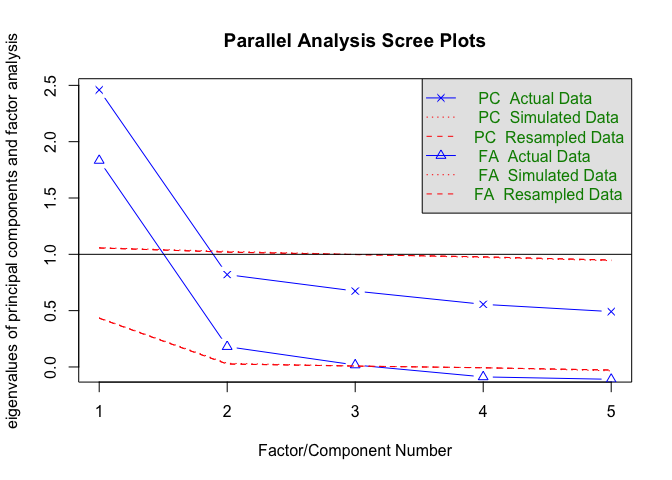

HW1
================

## Read the data

``` r
HW1_data=
  read_csv(file="./data/HW2dat.csv")
```

    ## Parsed with column specification:
    ## cols(
    ##   C1 = col_double(),
    ##   C2 = col_double(),
    ##   C3 = col_double(),
    ##   C4 = col_double(),
    ##   C5 = col_double(),
    ##   C4_R = col_double(),
    ##   C5_R = col_double()
    ## )

install.packages(“psych”) install.packages(“GPArotation”)

``` r
library(psych)
```

    ## 
    ## Attaching package: 'psych'

    ## The following objects are masked from 'package:ggplot2':
    ## 
    ##     %+%, alpha

``` r
library(GPArotation)
```

\#\#\#descriptive
    statistics

``` r
summary(HW1_data)
```

    ##        C1              C2              C3            C4             C5       
    ##  Min.   :1.000   Min.   :1.000   Min.   :1.0   Min.   :1.00   Min.   :1.000  
    ##  1st Qu.:4.000   1st Qu.:4.000   1st Qu.:4.0   1st Qu.:1.00   1st Qu.:2.000  
    ##  Median :5.000   Median :5.000   Median :5.0   Median :2.00   Median :3.000  
    ##  Mean   :4.525   Mean   :4.372   Mean   :4.3   Mean   :2.55   Mean   :3.306  
    ##  3rd Qu.:5.000   3rd Qu.:5.000   3rd Qu.:5.0   3rd Qu.:4.00   3rd Qu.:5.000  
    ##  Max.   :6.000   Max.   :6.000   Max.   :6.0   Max.   :6.00   Max.   :6.000  
    ##       C4_R           C5_R      
    ##  Min.   :1.00   Min.   :1.000  
    ##  1st Qu.:3.00   1st Qu.:2.000  
    ##  Median :5.00   Median :4.000  
    ##  Mean   :4.45   Mean   :3.694  
    ##  3rd Qu.:6.00   3rd Qu.:5.000  
    ##  Max.   :6.00   Max.   :6.000

### adds the data so variable names can be used without pre-specificaiton of data names

``` r
attach(HW1_data)
```

## Question 1: Obtain eigenvalues and scree plot associated with the Pearson Correlation matrix of the 5 items

\#\#\#create an object with just the variables we want to
    analyze

``` r
usevars_1<-cbind(C1, C2, C3, C4, C5)
```

### Using Pearson Correlation

``` r
HW1parallel_pearson<-fa.parallel(usevars_1)
```

<!-- -->

    ## Parallel analysis suggests that the number of factors =  3  and the number of components =  1

``` r
str(HW1parallel_pearson)
```

    ## List of 10
    ##  $ fa.values: num [1:5] 1.8333 0.1805 0.0174 -0.0882 -0.1098
    ##  $ pc.values: num [1:5] 2.459 0.82 0.674 0.556 0.491
    ##  $ pc.sim   : num [1:5] 1.059 1.026 0.999 0.972 0.944
    ##  $ pc.simr  : num [1:5] 1.056 1.019 0.998 0.977 0.949
    ##  $ fa.sim   : num [1:5] 0.43664 0.03281 0.0081 -0.00645 -0.03447
    ##  $ fa.simr  : num [1:5] 0.43294 0.02641 0.0079 -0.00717 -0.02726
    ##  $ nfact    : num 3
    ##  $ ncomp    : num 1
    ##  $ Call     : language fa.parallel(x = usevars_1)
    ##  $ values   : num [1:20, 1:20] 1.06 1.05 1.03 1.06 1.07 ...
    ##   ..- attr(*, "dimnames")=List of 2
    ##   .. ..$ : NULL
    ##   .. ..$ : chr [1:20] "C1" "C2" "C3" "C4" ...
    ##  - attr(*, "class")= chr [1:2] "psych" "parallel"

``` r
HW1parallel_pearson$pc.values
```

    ## [1] 2.4591586 0.8198971 0.6736977 0.5559400 0.4913066

``` r
#HW1parallel_pearson$pc.sim$mean
```

### Question 2: Report the internal consistency associated with simple sum

\#\#\#Using polychoric correlation and do parallel anlaysis of
eigenvalues

``` r
usevars_2<-cbind(C1, C2, C3, C4_R, C5_R)
```

### cronbach’s alpha

``` r
HW1alpha<- alpha(usevars_2)
HW1alpha
```

    ## 
    ## Reliability analysis   
    ## Call: alpha(x = usevars_2)
    ## 
    ##   raw_alpha std.alpha G6(smc) average_r S/N    ase mean   sd median_r
    ##       0.74      0.74    0.71      0.36 2.9 0.0084  4.3 0.96     0.36
    ## 
    ##  lower alpha upper     95% confidence boundaries
    ## 0.72 0.74 0.75 
    ## 
    ##  Reliability if an item is dropped:
    ##      raw_alpha std.alpha G6(smc) average_r S/N alpha se  var.r med.r
    ## C1        0.70      0.71    0.65      0.38 2.4   0.0097 0.0038  0.36
    ## C2        0.69      0.69    0.63      0.36 2.2   0.0102 0.0056  0.35
    ## C3        0.70      0.71    0.66      0.37 2.4   0.0099 0.0071  0.38
    ## C4_R      0.66      0.67    0.61      0.34 2.1   0.0111 0.0037  0.33
    ## C5_R      0.70      0.70    0.64      0.37 2.4   0.0098 0.0017  0.36
    ## 
    ##  Item statistics 
    ##         n raw.r std.r r.cor r.drop mean  sd
    ## C1   2436  0.65  0.68  0.55   0.47  4.5 1.2
    ## C2   2436  0.70  0.71  0.61   0.51  4.4 1.3
    ## C3   2436  0.67  0.68  0.55   0.48  4.3 1.3
    ## C4_R 2436  0.75  0.74  0.66   0.57  4.5 1.4
    ## C5_R 2436  0.72  0.69  0.57   0.49  3.7 1.6
    ## 
    ## Non missing response frequency for each item
    ##         1    2    3    4    5    6 miss
    ## C1   0.02 0.06 0.10 0.23 0.37 0.22    0
    ## C2   0.03 0.09 0.10 0.23 0.34 0.20    0
    ## C3   0.03 0.09 0.11 0.27 0.33 0.17    0
    ## C4_R 0.02 0.08 0.16 0.17 0.29 0.28    0
    ## C5_R 0.10 0.17 0.22 0.12 0.21 0.18    0

# Question 3:

``` r
HW1alpha<- alpha(usevars_1)
```

    ## Warning in alpha(usevars_1): Some items were negatively correlated with the total scale and probably 
    ## should be reversed.  
    ## To do this, run the function again with the 'check.keys=TRUE' option

    ## Some items ( C4 C5 ) were negatively correlated with the total scale and 
    ## probably should be reversed.  
    ## To do this, run the function again with the 'check.keys=TRUE' option

``` r
HW1alpha
```

    ## 
    ## Reliability analysis   
    ## Call: alpha(x = usevars_1)
    ## 
    ##   raw_alpha std.alpha G6(smc) average_r  S/N   ase mean   sd median_r
    ##      -0.32     -0.26    0.13    -0.043 -0.2 0.045  3.8 0.55    -0.28
    ## 
    ##  lower alpha upper     95% confidence boundaries
    ## -0.4 -0.32 -0.23 
    ## 
    ##  Reliability if an item is dropped:
    ##    raw_alpha std.alpha G6(smc) average_r     S/N alpha se var.r  med.r
    ## C1    -0.468   -0.5163  -0.028  -0.09305 -0.3405    0.050  0.16 -0.327
    ## C2    -0.413   -0.4777  -0.029  -0.08792 -0.3233    0.047  0.15 -0.306
    ## C3    -0.294   -0.3309   0.091  -0.06628 -0.2487    0.044  0.17 -0.282
    ## C4    -0.030    0.1226   0.291   0.03375  0.1397    0.035  0.14  0.028
    ## C5    -0.054    0.0013   0.245   0.00032  0.0013    0.033  0.17 -0.020
    ## 
    ##  Item statistics 
    ##       n raw.r std.r r.cor r.drop mean  sd
    ## C1 2436  0.47  0.56  0.52  0.026  4.5 1.2
    ## C2 2436  0.47  0.54  0.53 -0.013  4.4 1.3
    ## C3 2436  0.40  0.48  0.27 -0.077  4.3 1.3
    ## C4 2436  0.27  0.18 -0.39 -0.233  2.5 1.4
    ## C5 2436  0.41  0.28 -0.20 -0.197  3.3 1.6
    ## 
    ## Non missing response frequency for each item
    ##       1    2    3    4    5    6 miss
    ## C1 0.02 0.06 0.10 0.23 0.37 0.22    0
    ## C2 0.03 0.09 0.10 0.23 0.34 0.20    0
    ## C3 0.03 0.09 0.11 0.27 0.33 0.17    0
    ## C4 0.28 0.29 0.17 0.16 0.08 0.02    0
    ## C5 0.18 0.21 0.12 0.22 0.17 0.10    0
